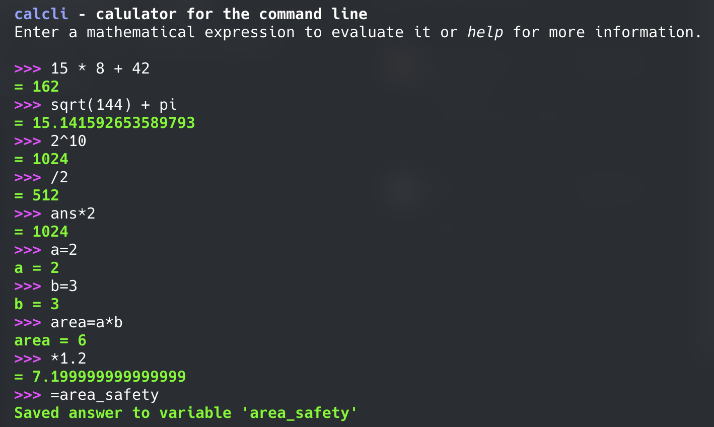

# calcli

A command-line calculator built with Rust, designed for quick mathematical evaluations with support for variables and previous answer references.



## Features

- **Expression evaluation**: Evaluate mathematical expressions using standard operators and functions
- **Previous answer reference**: Use `ans` to reference the result from your last calculation
- **Variable support**: Define and use variables in your calculations
- **Operator shortcuts**: Start expressions with `+`, `-`, `*`, or `/` to automatically apply them to the previous answer
- **Localization support**: Use point (`.`) comma (`,`) as decimal separator and semicolon (`;`) as argument separator
- **Interactive REPL**: Color-coded output with command history

## Installation

```zsh
# Clone the repository
git clone https://github.com/yourusername/calcli.git
cd calcli

# Build and run
cargo run --release
```

## Usage

Start the calculator by running the executable. You'll be greeted with an interactive prompt:

```
calcli – calculator for the command line
Enter a mathematical expression to evaluate it or help for more information.

>>>
```

### Basic Calculations

```
>>> 5 + 3
= 8

>>> 2 * pi
= 6.283185307179586

>>> sqrt(16)
= 4
```

### Using Previous Answer

Reference the last result with `ans`:

```
>>> 10 + 5
= 15

>>> ans * 2
= 30

>>> + 10
= 40
```

### Variables

Define and use variables in your calculations:

```
>>> x = 5
x = 5

>>> y = x * 2
y = 10

>>> x + y
= 15
```

### Decimal and Argument Separators

Use comma as decimal separator (converted to dot internally):

```
>>> 3,14 * 2
= 6.28
```

Use semicolon to separate function arguments:

```
>>> max(5; 10; 3)
= 10
```

## Commands

- **`.q`** or **CTRL-D**: Exit the calculator
- **CTRL-C**: (Planned) Copy last result to clipboard
- **`help`**: (Planned) Display help information

## Roadmap

- [x] Allow the use of "ans"
- [x] Allow the definition of variables and their use in expressions
- [ ] Add keyboard bindings for number of decimals and scientific notation
- [ ] Include a help command that lists available commands and features
- [ ] Implement clipboard support for CTRL-C

## Dependencies

- [meval](https://crates.io/crates/meval) - Mathematical expression evaluation
- [rustyline](https://crates.io/crates/rustyline) - Readline implementation for interactive input
- [colored](https://crates.io/crates/colored) - Terminal color output

## License

MIT License. See `LICENSE` file for details.
